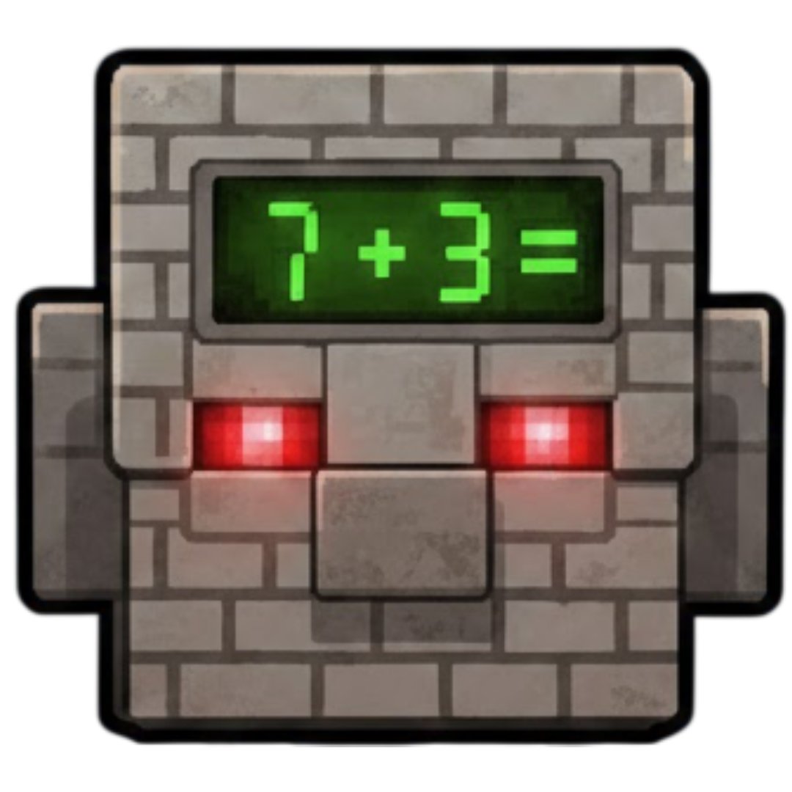

# Dol Bot

A fast and accurate stronghold triangulation tool for Minecraft speedrunning. Built with C++ and Qt for maximum speed and a clean, modern look.

## Installation

1.  **Download**: Go to the [Releases Page](https://github.com/rep0z-debug/Dol-Bot/releases) and download the latest `.zip`.
2.  **Extract**: Right-click the zip file and select **Extract All...**.
3.  **Run**: Open the folder and double-click `DolBot.exe`.

> **Note**: If Windows says *"Windows protected your PC"*, click **More info** -> **Run anyway**. This happens because this is a new tool not yet signed by Microsoft.

## What It Does

Dol Bot reads your F3+C coordinates and figures out where your stronghold is. Throw a couple of ender eyes, look at them, press F3+C each time, and the bot does the math for you. It tells you where to go and how confident it is in the result.

The more throws you give it, the more accurate it gets. Two good throws usually give you 90%+ confidence. If you're in a boat, you get even better precision because boat angles snap to a grid.

## Features

**Core Stuff:**
- Reads F3+C from clipboard automatically
- Shows you where the stronghold is with a confidence percentage
- Remembers your throws between sessions so you don't lose progress
- Checks for updates when you start it
- Mismeasure detection and throw suggestions

**Boat Mode:**
- Toggle with Ctrl+B or auto-detect when entering a boat
- Uses the high-precision boat angle grid
- Negative angles give 10x better accuracy than positive
- Supports enter boat and mod 360 hotkeys for advanced boat maneuvers

**Privacy & Streaming:**
- Hide from OBS, Discord, or all screen capture software
- Toggle fake coordinates if you're streaming (optional)
- Toggle privacy mode instantly with Ctrl+H
- Privacy indicator shows current status

**Blind Travel:**
- Look down and press F3+C in the nether
- Gets you highroll probabilities for your portal location
- Portal linking warnings

**Divine/Fossil:**
- Use F3+I on a fossil to determine your stronghold ring
- Enable in Settings -> General -> Enable Divine

**Calibration:**
- Built-in tool to calculate your personal standard deviation
- Uses your real throws to figure out how accurate you are
- Makes predictions more reliable

**Themes & Customization:**
- 16 built-in themes: Dark, Light, Midnight, Ocean, Forest, Sunset, Rose, Cyber, Nord, Dracula, Monokai, Solarized, Tokyo Night, Catppuccin, One Dark, and Amethyst
- Full theme editor with live preview
- Create, import, and export custom themes
- Customizable overlay appearance

**Settings:**
- Export and import settings for backup or sharing
- Settings validation on import for security

**HTTP API:**
- Runs on localhost:52533
- External tools can read your predictions
- Supports reset and undo commands

## How to Use

1. Open Dol Bot
2. In Minecraft, throw an ender eye
3. Look at where the eye is going
4. Press F3+C
5. Repeat once or twice
6. Go to the coordinates it shows you

That's it. The bot handles everything else.

## Keyboard Shortcuts

All hotkeys are customizable in Settings -> Hotkeys.

| Shortcut | What It Does |
|----------|--------------|
| Ctrl+R | Reset everything |
| Ctrl+Z | Undo last throw |
| Ctrl+Y | Redo last undo |
| Ctrl+L | Lock/unlock the result |
| Ctrl+B | Toggle boat mode |
| Ctrl+H | Toggle privacy mode |
| Ctrl+] | Adjust last angle by +0.01° |
| Ctrl+[ | Adjust last angle by -0.01° |
| Ctrl+, | Open settings |
| N/A | Enter boat mode |
| N/A | Mod 360 |

All shortcuts are customizable in Settings -> Hotkeys.

## Settings

**Standard Deviation** - This is how accurate your throws are. Lower numbers mean you're more precise. The calibration tool can figure this out for you, but here's a rough guide:

- 0.05-0.20: Quake Pro FOV, fast throws
- 0.02-0.04: 30 FOV, careful throws  
- 0.005-0.01: 30 FOV with subpixel adjustment
- 0.001: Boat mode

**Crosshair Correction** - If your crosshair is slightly off-center on certain resolutions, you can fix it here.

**Minecraft Version** - Set this to match your game version. Different versions generate strongholds differently.

**Display Mode** - Choose between 4,4 (default), 8,8, or chunk coordinates.

## Credits

Main developer: [rep0z-debug](https://github.com/rep0z-debug)

Inspired by Ninjabrain Bot. The probability math is based on how Minecraft actually generates strongholds.
*   The SVG icons used in this application are AI-generated.

Full credits: [Credits](CREDITS.md)

## Copyright

© 2025 Dol Bot (rep0z-debug). All rights reserved.